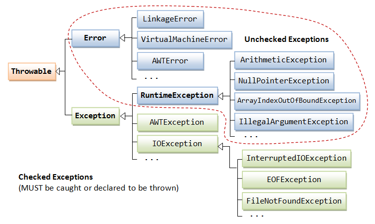
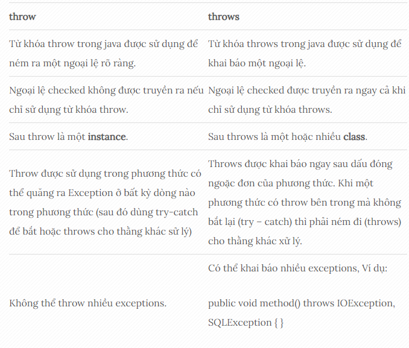

 #  [JAVA] BUỔI 9: LUÔN CÓ NGOẠI LỆ, XỬ LÍ NGOẠI LỆ
 
 ***
## 1. Làm quen với Exception: Checked và Unchecked Exception, Error

>*Tài liệu tham khảo*:  [Exception](https://yellowcodebooks.com/2018/01/25/java-bai-37-exception-tap-1-lam-quen-voi-exception/)

\- **Ngoại lệ (exception)** là thuật ngữ chỉ tình trạng sai hoặc bất thường xảy ra khi một chương trình đang chạy. Ví dụ: khi chương trình thực hiện phép chia cho 0 (ngoại lệ tính toán số học), đọc phải một giá trị không nguyên trong khi đang chờ đọc một giá trị kiểu int (ngoại lệ định dạng số), hoặc truy cập tới một phần tử không nằm trong mảng (ngoại lệ chỉ số nằm ngoài mảng), …


\- Có 3 lọai **Exception**:

+ Checked Exception
+ Unchecked Exception
+ Error

### 1.1: Checked Exception

\- **Checked Exception (Ngoại lệ kiểm tra)**: Đây là các ngoại lệ mà trình biên dịch yêu cầu bạn phải xử lý, thông qua việc sử dụng khối try-catch hoặc khai báo throws để chuyển nó cho phương thức gọi. Các **checked exception** thường phản ánh các điều kiện không mong muốn như việc mở tập tin không tồn tại, mất kết nối mạng,... và là các tình huống có thể xảy ra và cần được xử lý.

```
import java.io.*;

public class Main {
    public static void main(String[] args) {
        try {
            // Mã có thể gây ra các checked exception
            FileReader file = new FileReader("file.txt");
            // Thực hiện các thao tác với file
        } catch (FileNotFoundException e) {
            // Xử lý exception
            System.out.println("Không tìm thấy file.");
        }
    }
}
```

### 1.2: Unchecked Exception

**Unchecked Exception (Ngoại lệ không kiểm tra)**: Đây là các ngoại lệ mà trình biên dịch không yêu cầu bạn phải xử lý tại thời điểm biên dịch. Thường là các ngoại lệ do lỗi logic trong chương trình như NullPointerException, ArrayIndexOutOfBoundsException, ArithmeticException,...

```
public class Main {
    public static void main(String[] args) {
        // Mã có thể gây ra các unchecked exception
        int[] arr = new int[3];
        System.out.println(arr[5]); // Mảng chỉ có 3 phần tử, nhưng truy cập index 5 sẽ gây ra ArrayIndexOutOfBoundsException
    }
}
```

### 1.3: Error

**Error**: Các lỗi là các vấn đề mà chương trình không thể xử lý hoặc khôi phục được, thường là do môi trường thực thi (runtime environment) gặp phải. Các lỗi thường chỉ xảy ra trong các tình huống nghiêm trọng như lỗi cấp phát bộ nhớ hoặc lỗi hệ thống.

```
public class Main {
    public static void main(String[] args) {
        // Mã gây ra một lỗi OutOfMemoryError bằng cách cố tình cấp phát quá nhiều bộ nhớ
        int[] arr = new int[Integer.MAX_VALUE];
    }
}
```

*Trong ví dụ này, chương trình cố gắng cấp phát một mảng lớn đến mức vượt quá giới hạn bộ nhớ của hệ thống, dẫn đến lỗi OutOfMemoryError.*

## 2. Bắt Exception với try-catch

### 2.1: Định nghĩa:
/- Khối **try-catch** trong Java cho phép bạn thực hiện một khối mã có thể ném ra các exception, và bắt các exception đó để xử lý chúng một cách an toàn.

### 2.2: Cú pháp:

```
try {
    // Mã có thể ném ra các exception
} catch (ExceptionType1 e1) {
    // Xử lý exception của ExceptionType1
} catch (ExceptionType2 e2) {
    // Xử lý exception của ExceptionType2
} finally {
    // (Optional) Mã trong finally sẽ luôn được thực thi, dù có exception hay không
}
```
### 2.2: Ví dụ:

```
public class Main {
    public static void main(String[] args) {
        try {
            int result = divide(10, 0); // Gọi phương thức có thể ném ra exception
            System.out.println("Kết quả: " + result);
        } catch (ArithmeticException e) { // Bắt exception cụ thể: ArithmeticException
            System.out.println("Lỗi chia cho số 0: " + e.getMessage());
        }
    }

    // Phương thức chia hai số và có thể ném ra ArithmeticException nếu số thứ hai là 0
    public static int divide(int a, int b) {
        return a / b;
    }
}
```
*Trong ví dụ này, chúng ta cố gắng chia một số cho 0 trong phương thức divide(), điều này sẽ gây ra một ArithmeticException. Bằng cách sử dụng khối try-catch, chúng ta bắt và xử lý exception này một cách an toàn để chương trình không bị crash khi nó xảy ra.*


### 3: Khối lệnh finally trong java

>*Tài liệu tham khảo*:  [finally ](https://viettuts.vn/exception-handling/khoi-lenh-finally-trong-java)


\- **Khối lệnh finally** trong java được sử dụng để thực thi các lệnh quan trọng như đóng kết nối, đóng cá stream,...

\- **Khối lệnh finally** trong java luôn được thực thi cho dù có ngoại lệ xảy ra hay không hoặc gặp lệnh return trong khối try.

Khối lệnh finally trong java được khai báo sau khối lệnh try hoặc sau khối lệnh catch.


### 3.1: Cú pháp:

```
try {
    // Mã có thể ném ra các exception
} catch (ExceptionType e) {
    // Xử lý exception của ExceptionType
} finally {
    // Mã trong finally sẽ luôn được thực thi, dù có exception hay không
}
```

### 3.2: Cách sử dụng khối finally trong java

\- Dưới đây là các trường hợp khác nhau về việc sử dụng khối finally trong java.

#### 3.2.1: Sử dụng khối lệnh finally nơi ngoại lệ không xảy ra.

```
public class TestFinallyBlock {
    public static void main(String args[]) {
        try {
            int data = 25 / 5;
            System.out.println(data);
        } catch (NullPointerException e) {
            System.out.println(e);
        } finally {
            System.out.println("finally block is always executed");
        }
        System.out.println("rest of the code...");
    }
}
```
Output:

```
5
finally block is always executed
rest of the code...
```
#### 3.2.2: sử dụng khối lệnh finally nơi ngoại lệ xảy ra nhưng không xử lý.

```
public class TestFinallyBlock1 {
    public static void main(String args[]) {
        try {
            int data = 25 / 0;
            System.out.println(data);
        } catch (NullPointerException e) {
            System.out.println(e);
        } finally {
            System.out.println("finally block is always executed");
        }
        System.out.println("rest of the code...");
    }
}
```

Output:

```
finally block is always executed
Exception in thread "main" java.lang.ArithmeticException: / by zero
```

#### 3.2.3: sử dụng khối lệnh finally nơi ngoại lệ xảy ra và được xử lý.

```
public class TestFinallyBlock2 {
    public static void main(String args[]) {
        try {
            int data = 25 / 0;
            System.out.println(data);
        } catch (ArithmeticException e) {
            System.out.println(e);
        } finally {
            System.out.println("finally block is always executed");
        }
        System.out.println("rest of the code...");
    }
}
```
Output:

```
java.lang.ArithmeticException: / by zero
finally block is always executed
rest of the code...
```
#### 3.2.4:Sử dụng khối lệnh finally trong trường hợp trong khối try có lệnh return.


```
public class TestFinallyBlock3 {
    public static void main(String args[]) {
        try {
            int data = 25;
            if (data % 2 != 0) {
             System.out.println(data + " is odd number");
             return;
            }
        } catch (ArithmeticException e) {
            System.out.println(e);
        } finally {
            System.out.println("finally block is always executed");
        }
        System.out.println("rest of the code...");
    }
}
```

Output:

```
25 is odd number
finally block is always executed
```

## 3. Cây phân cấp Exception, phân biệt throw và throws



\- Trong cây phân cấp này, Throwable là lớp cơ sở, và nó có hai nhánh chính: Error và Exception. Error thường chỉ ra các vấn đề nghiêm trọng liên quan đến môi trường thực thi, trong khi Exception thường chỉ ra các vấn đề có thể xử lý trong chương trình. Exception lại được chia thành hai loại chính là IOException và RuntimeException, với RuntimeException là loại exception không cần phải được khai báo.

\- Mỗi exception trong cây phân cấp này có một hoặc nhiều exception con, và một số exception có thể có các lớp con trong các nhánh khác nhau của cây. Điều này tạo ra một cấu trúc phân cấp linh hoạt cho việc xử lý ngoại lệ trong Java.


### 3.1: throw 

>*Tài liệu tham khảo*:  [throw ](https://viettuts.vn/exception-handling/tu-khoa-throw-trong-java)

### 3.2: throws

>*Tài liệu tham khảo*:  [throws ](https://viettuts.vn/exception-handling/tu-khoa-throws-trong-java)

### 3.3: phân loại

>*Tài liệu tham khảo*:  [phân loại](https://gpcoder.com/2447-tu-khoa-throw-va-throws-trong-java/)




## 4.

```
// Định nghĩa lớp exception tùy chỉnh kế thừa từ lớp Exception
class MyCustomException extends Exception {
    // Constructor với thông điệp cho exception
    public MyCustomException(String message) {
        super(message);
    }
}

public class Main {
    // Phương thức sử dụng exception tùy chỉnh
    public static void test() throws MyCustomException {
        throw new MyCustomException("Đây là một exception tùy chỉnh!");
    }

    public static void main(String[] args) {
        try {
            test(); // Gọi phương thức có thể ném ra exception tùy chỉnh
        } catch (MyCustomException e) { // Bắt exception tùy chỉnh
            System.out.println("Đã xảy ra một exception tùy chỉnh: " + e.getMessage());
        }
    }
}

```